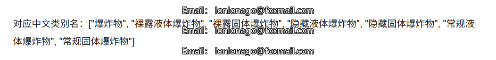
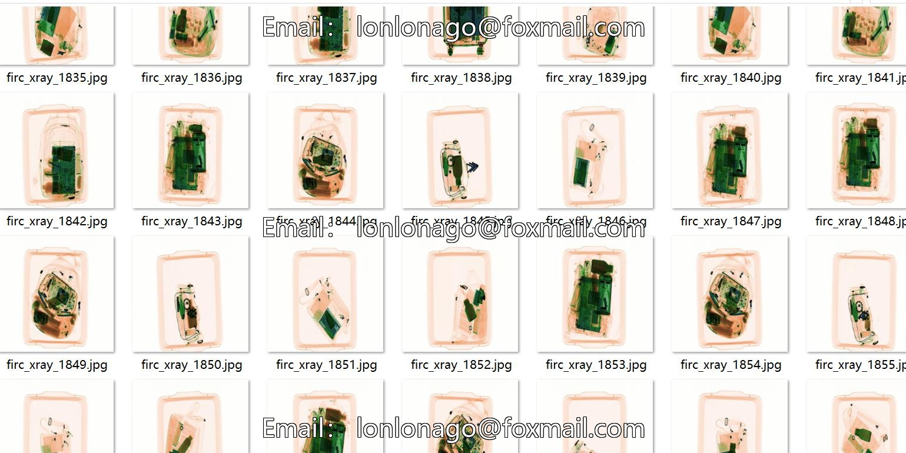
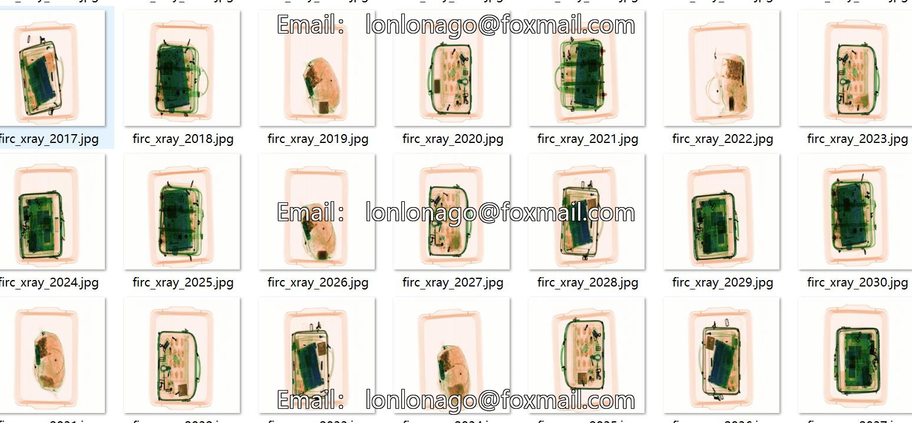
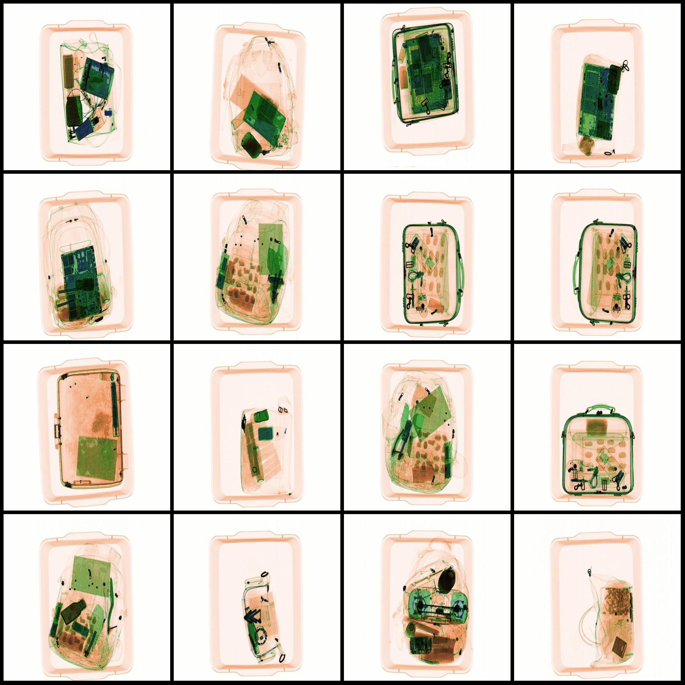
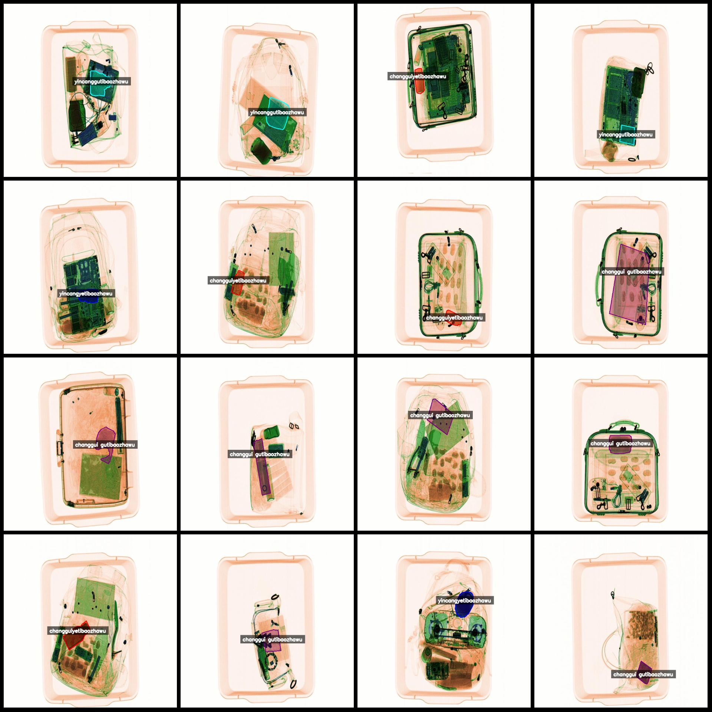
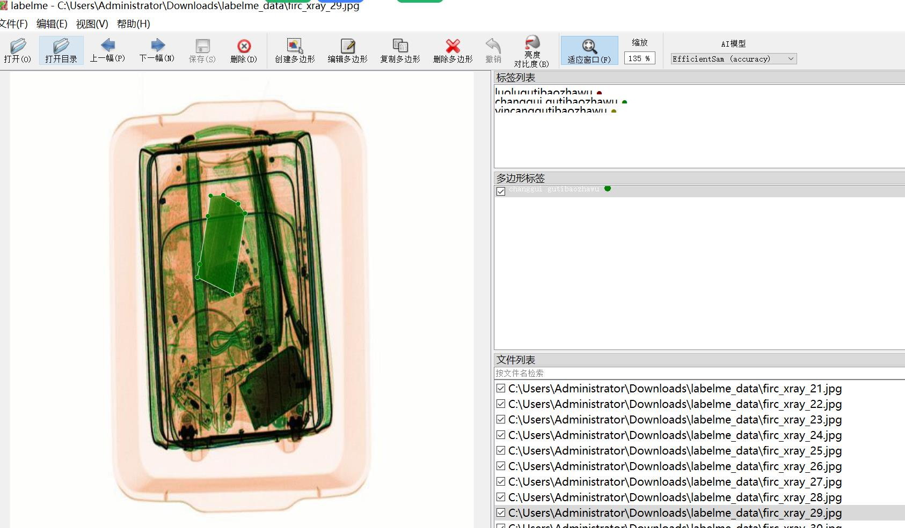

# X-ray Security Solid, Liquid, and Dangerous Goods Identification and Segmentation Dataset (labelme format: 3672 images with 6 categories)

Dataset format: labelme format (excluding mask files, only containing JPG images and corresponding JSON files)
Number of images (JPG file counts): 3672
Number of annotations (JSON file counts): 3672
Number of annotation categories: 6
Annotation category names: ["changgui gutibaozhawu", "changguiyetibaozhawu", "luolugutibaozhawu", "luoluyetibaozhawu", "yincanggutibaozhawu", "yincangyetibaozhawu"]
Number of boxes per category:
changgui gutibaozhawu count = 914
changguiyetibaozhawu count = 901
luolugutibaozhawu count = 120
luoluyetibaozhawu count = 154
yincanggutibaozhawu count = 950
yincangyetibaozhawu count = 648
Total boxes: 3687
Annotation tool used: labelme=5.5.0
Image resolution: 640x640
Annotation rule: Polygons are drawn around the categories
Important Notice: The dataset can be opened and edited using labelme; however, the JSON dataset needs to be converted into a mask or YOLOF/COCO format for semantic segmentation or instance 
segmentation
Special Notice: This dataset does not guarantee any accuracy in the trained models or the weights files
Image previews:  
Annotation examples:  
Original images (randomly selected 16 images):  
Annotation drawing results:  
Labelme editing image example:

## Images

Here is a pay link on Stripe ( https://buy.stripe.com/3cs8yP7sY87d0vu9AB ). Please contact me lonlonago@foxmail.com after funding $89, and I will send you a complete data files , thank you!

